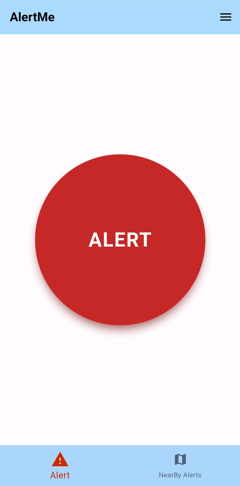

# alertMe

client application of Emergency Alert System developed as a part of KTU Mini Project (CSD 334).

## Problem Statement
> To develop an emergency alert system to send emergency alerts to nearby users, authorities and emergency contacts, along with real-time location and relevant medical information with an easy to access alert button.

## Screenshots

  
  
  
  
  

  
  
  
  
  

## Features
- Easy to access alert button
- Location based notifications
- SMS alert to emergency contacts
- User profile with medical details (eg: blood group)
- Google map for location tracking
- Realtime push notifications for alerts
- False alarm reporting
- Alert tag to provide more details
## Tools used
- flutter sdk: v3.10.1
- Node js
- MongoDB
- Firebase
